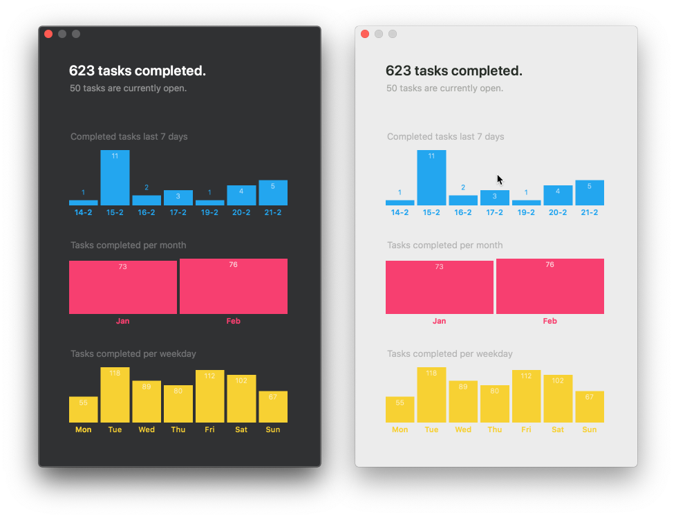
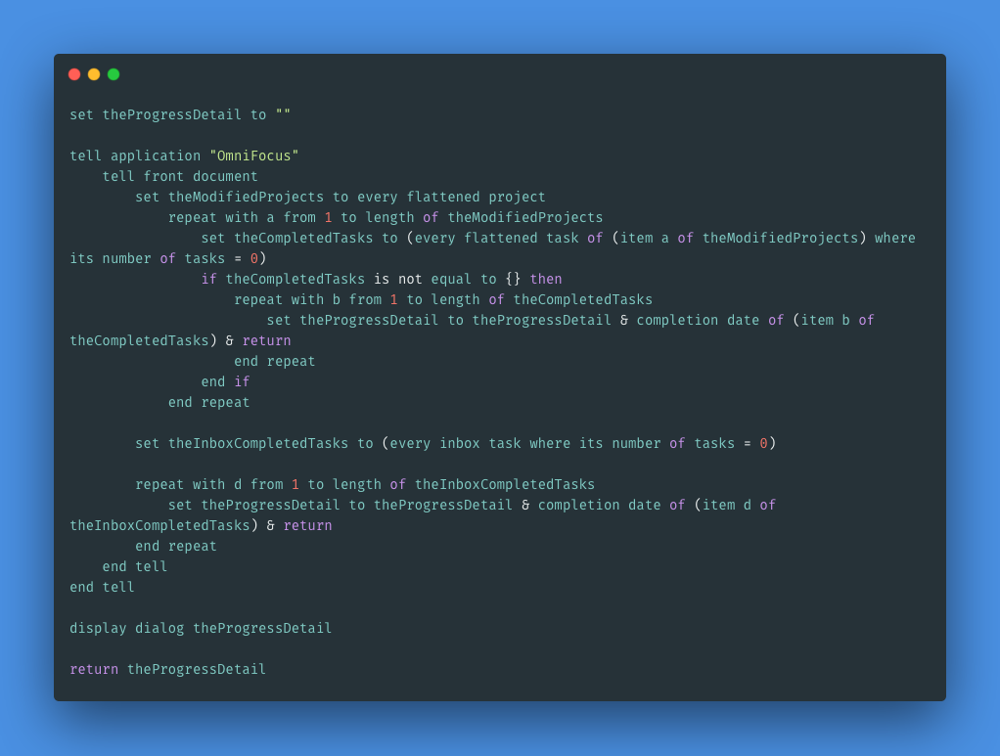

# Vibe

Based on [tschoffelen/vibe](https://github.com/tschoffelen/vibe)

A tiny tool that allows you to see how you're doing with your [OmniFocus](https://www.omnigroup.com/omnifocus/) tasks.

**[Download the latest version here](https://github.com/hechen/vibe/releases)**

Based on AppleScript, you can get all the tasks stats. The script used by this project as below.

